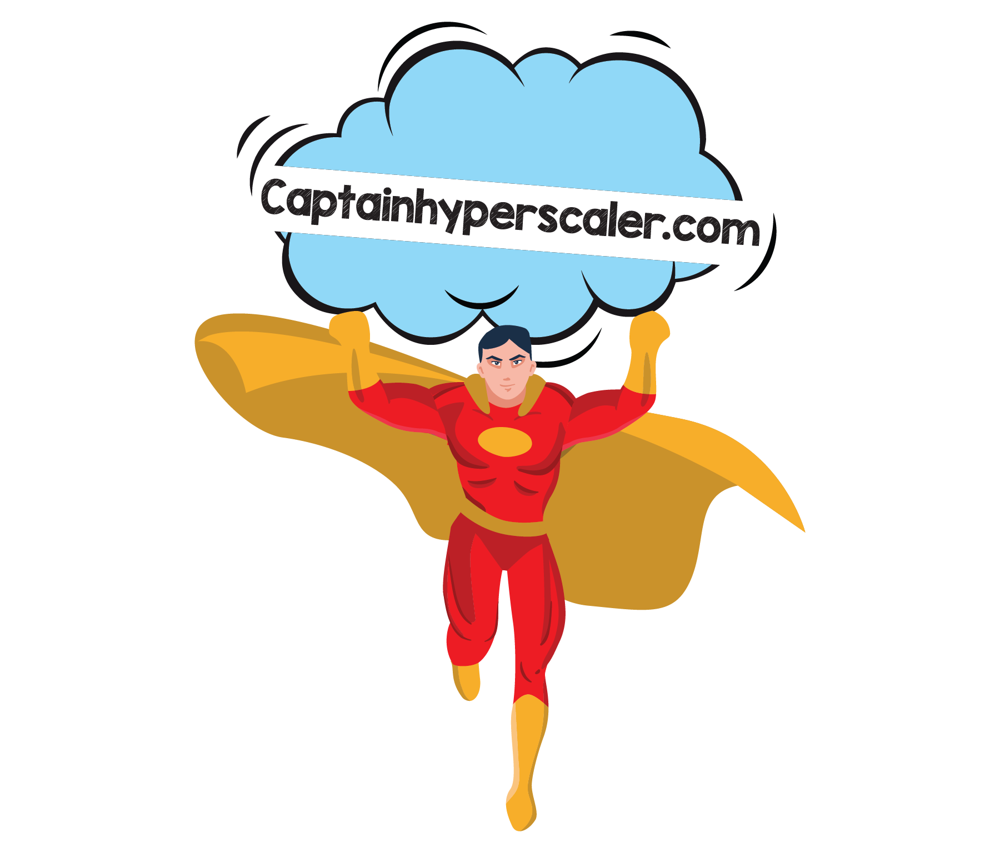

# Welcome to Azure Back to School

## **Event Mission**
In the spirit of the #AzureFamily from #AzureAdventCalendar and #AzureSpringClean, I will be continuing the momentum with an end of summer event in September. 

Content is a mix of blog articles and/or videos that are provided by the contributors in the list below. Hyperlinks to each topic’s content will be updated each day. Contributors are also asked to post their contribution on social media (Twitter and LinkedIn, at minimum) with the link to this page (https://azurebacktoschool.tech) and the hashtag #AzureBacktoSchool. Videos can be found on the Captain Hyperscaler YouTube channel in the [Azure Back to School playlist](https://www.youtube.com/playlist?list=PLEyhcNWyLQRkcdDu_MOy9Wv7mjUL18a26)

See Azure Advent Calendar [Azure Advent Calendar](https://azureadventcalendar.com/)  and [Azure Spring Clean](https://www.azurespringclean.com/) sites for some great content to help you with ideas and education. 

## **2020 Event Submissions**

|  |  |  |
|----------|----------|:-------------:|
|Date	|Topic	|Contributor|
|1-Sep-2020	|[Welcome to Azure Back-to-School](https://captainhyperscaler.com/?p=871) plus [“Breaking Down the Network Chains” – Network Watcher](https://youtu.be/PT8L68ZE13I)|	[Dwayne Natwick](http://twitter.com/DwayneNcloud)|
|2-Sep-2020	|[How to Build an Azure Kubernetes Cluster using Managed Azure Active Directory integration](https://pixelrobots.co.uk/2020/09/how-to-build-an-azure-kubernetes-cluster-using-managed-azure-active-directory-integration/)|	[Richard Hooper](http://twitter.com/pixel_robots)|
|3-Sep-2020	|[Azure Certification Preparation – Video](https://youtu.be/hhw8lFb5yzA), [Azure Certification Preparation – Post](https://gregorsuttie.com/2020/09/03/azure-certification-prep/)	|[Gregor Suttie](http://twitter.com/gregor_suttie)|
|4-Sep-2020	|[Beginning with Azure Functions in Visual Studio](https://jurgenonazure.com/2020/08/azure-back-to-school-2020-beginning-with-azure-functions-in-visual-studio/)|	[Jurgen Kevelaers](http://twitter.com/JurgenOnAzure)|
|7-Sep-2020	|[Azure Hybrid including Hybrid Identity, Hybrid Device and Hybrid Exchange](https://iamitgeek.com/?p=278)|	[Shabaz Darr](http://twitter.com/ShabazDarr)|
|8-Sep-2020	|[Introduction to Azure Monitor](https://vaibhavgujral.com/2020/09/07/an-introduction-to-azure-monitor/)	|[Vaibhav Gujral](http://twitter.com/vabgujral)|
|9-Sep-2020	|[Azure Maps and Xamarin](https://dev.to/icebeam7/azure-maps-and-xamarin-kep)	|[Luis Beltran](http://twitter.com/darkicebeam)|
|10-Sep-2020	|[Windows Virtual Desktop](https://youtu.be/BmyiWwvR2oY)	|[Neil McLoughlin](http://twitter.com/virtualmac)|
|11-Sep-2020	|[Application Networking – Breaking Down the Azure Network Chains](https://youtu.be/omyqoL3oJh0)	|[Dwayne Natwick](http://twitter.com/dwaynencloud)|
|12-Sep-2020	|[Azure DevOps is not for IT Pro’s (says no one ever again) – Video](https://youtu.be/K4ClwqEKNys), [Blog post](https://www.007ffflearning.com/post/azure-back-to-school/)	|[Peter De Tender](http://twitter.com/pdtit)|
|13-Sep-2020	|[Serverless Big Data pipelines](https://dev.to/chixcancode/azure-back-to-school-2020-serverless-big-data-pipelines-data-storage-and-exploration-1m8a)	|[LaBrina Loving](http://twitter.com/chixcancode)|
|14-Sep-2020	|[Exploring Azure Resources with Azure Graph Explorer](https://azureis.fun/posts/Exploring-Azure-Resources-with-Azure-Graph-Explorer/)	|[Vukasin Terzic](http://twitter.com/MrTerzic)|
|15-Sep-2020	|[On-premise serverless app via Kubernetes and KEDA](https://medium.com/microsoftazure/lifting-function-to-kubernetes-with-keda-e24de86fca2e)	|[Stas Lebedenko](http://twitter.com/angry_stas)|
|16-Sep-2020	|[Azure AZ-900 study guide](https://www.skylinesacademy.com/az900-azure-fundamentals-ultimate-study-guide), [NEW! AZ-104 study guide](https://www.skylinesacademy.com/az-104-ultimate-study-guide)	|[Nick Colyer](http://twitter.com/vNickC)|
|17-Sep-2020	|[Azure Backup on Azure resources. Video](https://youtu.be/nfk01A3SBSY), [Blog post](https://wmatthyssen.com/2020/09/17/azure-back-to-school-azure-backup-for-azure-iaas-resources/)	|[Wim Matthyssen](http://twitter.com/wmatthyssen)|
|18-Sep-2020	|[The future of ARM Templates with Project Bicep](https://kareldewinter.com/azure-bicep-project/)	|[Karel De Winter](http://twitter.com/kareldewinter)|
|19-Sep-2020	|[Virtual Network Gateways (includes demo) – Breaking Down the Azure Network Chains](https://youtu.be/kWUltTKQeO0)	|[Dwayne Natwick](http://www.twitter.com/dwaynencloud)|
|20-Sep-2020	|[Azure Function keys and API management](https://youtu.be/tIlHEr1Fl3w)	|[Joel Hebert](http://twitter.com/JoelHerbert)|
|21-Sep-2020	|[Azure Sentinel](https://youtu.be/-KHMUwVbFjA)	|[Ed Baker](http://twitter.com/edbaker1965)|
|22-Sep-2020	|[Deploying Terraform from develop to production consecutively using Azure DevOps](https://thomasthornton.cloud/2020/09/22/deploying-terraform-from-develop-to-production-consecutively-using-azure-devops/)	|[Thomas Thornton](http://twitter.com/tamstar1234)|
|23-Sep-2020	|[Azure Lighthouse](https://azurealan.ie/2020/09/23/azure-back-to-school-azure-lighthouse/)	|[Alan Kinane](http://twitter.com/azure_alan)|
|24-Sep-2020	|[Migration Journey from on-premises to Azure](https://www.techielass.com/back-to-school-migration)	|[Sarah Lean](http://twitter.com/TechieLass)|
|25-Sep-2020	|[ARM templates overview](https://youtu.be/8iw3djtthZs)	|[Marco Obinu](http://twitter.com/OmegaMadLab)|
|26-Sep-2020	|[DevSecOps – Integrating Security Practices with Azure DevOps](https://youtu.be/aSYEHUGHRxE)	|[Mark Patton](http://twitter.com/Mark_D_Patton)|
|27-Sep-2020	|[Scalable Web Apps](https://youtu.be/bxBtNBVyszs)	|[Tiago Costa](http://twitter.com/tiagocostapt)|
|28-Sep-2020	|[Enterprise shared file services with Azure NetApp Files](https://youtu.be/afsiPRNbgMc)	|[Kirk Ryan](http://twitter.com/kirk__ryan)|
|29-Sep-2020	|[Building and Hosting client-side apps by leveraging Blazor, Static Website in Azure Storage and Azure CDN - Video](https://youtu.be/SHTo5xsGIqc), [Blog post](https://www.hugobarona.com/using-blazor-and-azure-static-web-apps-to-build-seamlessly-client-side-apps/)	|[Hugo Barona](http://twitter.com/HmsBarona)|
|30-Sep-2020	|Azure Pipelines to deploy ARM templates	|[Dave Rendon](http://twitter.com/DaveRndn)|
|1-Oct-2020	|Azure Back-to-School Wrap-up video, Blog post	|[Dwayne Natwick](https://twitter.com/DwayneNcloud)|
|  |  |  |

<a rel="noreferrer noopener" href="https:captainhyperscaler.com" target="_blank">https://captainhyperscaler.com</a>

