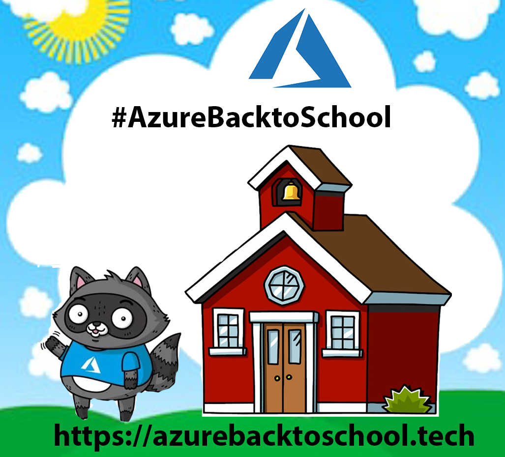

# Welcome to Azure Back to School

## **AZURE BACK TO SCHOOL 2021**
Azure Back to School is BACK in 2021.  This year, we would like to make this a true event to educate the community as well as mentor new speaker involvement.  

The schedule for this year's event is below.  Hyperlinks to each topic’s content will be updated each day. Contributors are also asked to post their contribution on social media (Twitter and LinkedIn, at minimum) with the link to this page (https://azurebacktoschool.tech) and the hashtag #AzureBacktoSchool. 

## **2021 Schedule and Content**

|  |  |  |
|----------|----------|:-------------:|
|Date	|Topic	|Contributor|
|1-Sep-2021	|[Welcome to Azure Back-to-School 2021](https://youtu.be/)|	[Dwayne Natwick](http://twitter.com/DwayneNcloud)|
|1-Sep-2021	|[Azure VMware Solution Overview](https://youtu.be/)|	[Shannon Kuehn](http://twitter.com/shankuehn)|
|2-Sep-2021	|[Microsoft Teams devices integration with Endpoint Manager](https://youtu.be)|	[Shabaz Darr](http://twitter.com/ShabazDarr)|
|2-Sep-2021	|[Azure API Management](https://youtu.be)|	[Jabir N P](http://twitter.com/Jabirnp)|
|3-Sep-2021	|[Audit VMs with Azure Guest Configuration Policy](https://youtu.be/)	|[Taha Baleegh Ansari](http://twitter.com/TechieTaha)|
|3-Sep-2021	|[The well-Architected solution in Azure and pillars of Azure Enterprise Architecture](https://youtu.be/)	|[Usama Wahab Khan](http://twitter.com/usamawahabkhan)|
|4-Sep-2021	|[Azure Private Link & Azure Private Endpoint, what's so Private about it?](https://youtu.be/)|	[Micha Wets](http://twitter.com/MichaWets) and [Wim Matthyssen](http://twitter.com/wmatthyssen)|
|5-Sep-2021	|[Send Custom Updates from Dynamics CRM to  Power Automate Flows for Integration](https://youtu.be/)|	[Abdul Kazi](http://twitter.com/abdulkazi) and [Chris Gill](http://twitter.com/cgill)|
|5-Sep-2021	|[Azure Cost Management](https://youtu.be/)|	[Venkata Subbarao Polisetty](http://twitter.com/Venkata48681009)|
|6-Sep-2021	|[From Zero to GitOps with AKS](https://youtu.be/)|	[Thomas Thornton](http://twitter.com/tamstar1234) and [Karl Cooke](http://twitter.com/Karl_ITNerd)|
|6-Sep-2021	|[Automating your Azure infrastructure with Pulumi](https://youtu.be/)|	[Ahmed Tidjani Belmansour](http://twitter.com/Tidjani_B)|
|7-Sep-2021	|[Jurassic Governance - 10 tips to save your resources from extinction](https://youtu.be/)|	[Yannick Dils](http://twitter.com/ydils1) and [Thomas Van Laere](http://twitter.com/thomas_vanlaere) |
|8-Sep-2021	|[Azure is 100% High-Available... or is it?](https://youtu.be/)	|[Peter De Tender](http://twitter.com/pdtit)|
|8-Sep-2021	|[Landing Zone at scale in regulated environment](https://youtu.be/)|[Michał Furmankiewicz](http://twitter.com/mifurm)|
|9-Sep-2021	|[Azure Cognitive Service: Bring AI to your applications in 3 steps!](https://youttu.be)	|[Luis Beltran](http://twitter.com/darkicebeam) and [Carla Vanesa Mamani Chavez](http://twitter.com/)|
|10-Sep-2021	|[Managing your Azure environment security guardrails with Azure Bicep](https://youtu.be/)	|[Elkhan Yusubov](http://twitter.com/ElYusubov)|
|11-Sep-2021	|[A practical guide to JIT and JEA with Azure AD PIM](https://youtu.be/)	|[Vukašin Terzić](http://twitter.com/MrTerzic)|
|12-Sep-2021	|[Analyzing Azure DevOps auditing streams in your SIEM of choice](https://youtu.be/)|[Peter De Tender](http://twitter.com/pdtit) and [James Cook](http://twitter.com/OfficialCookJ)|
|13-Sep-2021	|[Terraform versus Bicep as Azure deployment options](https://youtu.be)	|[John Folberth](http://twitter.com/j_folberth)|
|13-Sep-2021 |[API First Design and Azure API Management](https://youtu.be)|[Joel Hebert](http://twitter.com/JoelHebert)|
|14-Sep-2021	|[IaC - Accelerate, stabilize, and reduce costs in the cloud](https://youtu.be/)	|[Bailey Fitchett](http://twitter.com/) and [Chris Ayers](http://twitter.com/Chris_L_Ayers)|
|15-Sep-2021	|[DAPR in action: Pros and cons, lessons learned](https://youtu.be)	|[Stas Lebedenko](http://twitter.com/angry_stas) and [Illya Solovyov](http://twitter.com/)|
|16-Sep-2021	|[FinOps on Microsoft Azure](https://youtu.be)	|[Martyn Coupland](http://twitter.com/mrcoups)|
|17-Sep-2021	|[Bicep builders: Azure Sentinel and Policy as Code](https://youtu.be/)	|[Jesse Loudon](http://twitter.com/coder_au) and [Casey Mullineaux](http://twitter.com/Nurfballs)|
|18-Sep-2021	|[Managing AVD the modern way](https://youtu.be/)	|[Stefan Dingemanse](http://twitter.com/SDingemanse) and [Sander Rozemuller](http://twitter.com/SandeRozemuller)|
|19-Sep-2021	|[Monitor Office 365 Environment with Azure Sentinel](https://youtu.be/)	|[Nanddeep Nachan](http://www.twitter.com/NanddeepNachan) and [Smita Nachan](http://www.twitter.com/SmitaNachan) |
|20-Sep-2021	|[Evolution of ARM Templates, let's discuss and compare to other usual suspects](https://youtu.be/)	|[Maik van der Gaag](http://twitter.com/maikvandergaag)|
|21-Sep-2021	|[Zero to Hero with Azure Virtual WAN](https://youtu.be/)	|[Derek Smith](http://twitter.com/ConsidercloudDS)|
|22-Sep-2021	|[Managing Identity and Access in Azure](https://youtu.be)	|[Darren Robinson](http://twitter.com/stalbansdaz)|
|23-Sep-2021	|[Azure cloud for the web frontend developers](https://youtu.be)	|[Maxim Salnikov](http://twitter.com/webmaxru)|
|24-Sep-2021	|[Build everything on Serverless!](https://youtu.be)	|[Divakar Kumar](http://twitter.com/)|
|25-Sep-2021	|[Reporting and auditing for Azure DevOps](https://youtu.be/)	|[Richard Phillips](http://twitter.com/) and [Chris Ayers](http://twitter.com/Chris_L_Ayers)|
|26-Sep-2021	|[AIoT – Edge Video Analytics and Azure](https://youttu.be)	|[John Lunn](http://twitter.com/jonnychipz)|
|27-Sep-2021	|[Introduction to durable functions](https://youtu.be/)	|[Sanyukta Agrawal](http://twitter.com/)|
|28-Sep-2021	|[IoT Central for any extensible IoT project](https://youtu.be/)	|[Riccardo Zamana](http://twitter.com)|
|29-Sep-2021 |[Building connected environments with Azure Digital Twins](https://youtu.be/) |[Brian Gorman](http://twitter.com/blgorman)|
|29-Sep-2020	|[Security in the Cloud - 10 unknown facts you have to be very careful about while using Azure!](https://youtu.be/)|[Michał Furmankiewicz](http://twitter.com/mifurm)|
|30-Sep-2021	|[How to get the most of Azure Security Center?](https://youtu.be/)	|[Abdelmajid Aneddame](http://twitter.com/AbdelmajidAned1)|
|1-Oct-2021	|[Azure Back-to-School Wrap-up video](https://youtu.be/Igq7YIot9j8) and [Blog post](https://captainhyperscaler.com/2020/10/01/azurebacktoschool-2020-recap/)	|[Dwayne Natwick](https://twitter.com/DwayneNcloud)|
|  |  |  |

## **AZURE BACK TO SCHOOL 2021 ANNOUNCEMENT**
Azure Back to School is BACK in 2021.  This year, we would like to make this a true event to educate the community as well as mentor new speaker involvement.  The call for speakers is open at this link: [Azure Back to School Call for Speakers](https://sessionize.com/azure-back-to-school-2021).  We request that the submission is for a Video presentation with one experienced presenter and one new or less experienced presenter that you would like to assist in getting involved in the #CloudFamily community.

Feel free to reach out to me at @DwayneNcloud directly with any questions.

Hyperlinks to each topic’s content will be updated each day. Contributors are also asked to post their contribution on social media (Twitter and LinkedIn, at minimum) with the link to this page (https://azurebacktoschool.tech) and the hashtag #AzureBacktoSchool. We would like videos to be submitted a week prior to upload and schedule them on the [Captain Hyperscaler YouTube channel](https://www.youtube.com/c/captainhyperscaler) in the Azure Back to School 2021 playlist.  If you would like to have an accompanying blog post, you can do that as well, but the primary content should be a video recording.  Length is not important, but try to keep it under an hour.

See Azure Advent Calendar [Azure Festive Calendar](https://festivetechcalendar.com/)  and [Azure Spring Clean](https://www.azurespringclean.com/) sites for some great content to help you with ideas and education. 

## **2020 Content**

|  |  |  |
|----------|----------|:-------------:|
|Date	|Topic	|Contributor|
|1-Sep-2020	|[Welcome to Azure Back-to-School](https://captainhyperscaler.com/?p=871) plus [“Breaking Down the Network Chains” – Network Watcher](https://youtu.be/PT8L68ZE13I)|	[Dwayne Natwick](http://twitter.com/DwayneNcloud)|
|2-Sep-2020	|[How to Build an Azure Kubernetes Cluster using Managed Azure Active Directory integration](https://pixelrobots.co.uk/2020/09/how-to-build-an-azure-kubernetes-cluster-using-managed-azure-active-directory-integration/)|	[Richard Hooper](http://twitter.com/pixel_robots)|
|3-Sep-2020	|[Azure Certification Preparation – Video](https://youtu.be/hhw8lFb5yzA), [Azure Certification Preparation – Post](https://gregorsuttie.com/2020/09/03/azure-certification-prep/)	|[Gregor Suttie](http://twitter.com/gregor_suttie)|
|4-Sep-2020	|[Beginning with Azure Functions in Visual Studio](https://jurgenonazure.com/2020/08/azure-back-to-school-2020-beginning-with-azure-functions-in-visual-studio/)|	[Jurgen Kevelaers](http://twitter.com/JurgenOnAzure)|
|7-Sep-2020	|[Azure Hybrid including Hybrid Identity, Hybrid Device and Hybrid Exchange](https://iamitgeek.com/?p=278)|	[Shabaz Darr](http://twitter.com/ShabazDarr)|
|8-Sep-2020	|[Introduction to Azure Monitor](https://vaibhavgujral.com/2020/09/07/an-introduction-to-azure-monitor/)	|[Vaibhav Gujral](http://twitter.com/vabgujral)|
|9-Sep-2020	|[Azure Maps and Xamarin](https://dev.to/icebeam7/azure-maps-and-xamarin-kep)	|[Luis Beltran](http://twitter.com/darkicebeam)|
|10-Sep-2020	|[Windows Virtual Desktop](https://youtu.be/BmyiWwvR2oY)	|[Neil McLoughlin](http://twitter.com/virtualmac)|
|11-Sep-2020	|[Application Networking – Breaking Down the Azure Network Chains](https://youtu.be/omyqoL3oJh0)	|[Dwayne Natwick](http://twitter.com/dwaynencloud)|
|12-Sep-2020	|[Azure DevOps is not for IT Pro’s (says no one ever again) – Video](https://youtu.be/K4ClwqEKNys), [Blog post](https://www.007ffflearning.com/post/azure-back-to-school/)	|[Peter De Tender](http://twitter.com/pdtit)|
|13-Sep-2020	|[Serverless Big Data pipelines](https://dev.to/chixcancode/azure-back-to-school-2020-serverless-big-data-pipelines-data-storage-and-exploration-1m8a)	|[LaBrina Loving](http://twitter.com/chixcancode)|
|14-Sep-2020	|[Exploring Azure Resources with Azure Graph Explorer](https://azureis.fun/posts/Exploring-Azure-Resources-with-Azure-Graph-Explorer/)	|[Vukasin Terzic](http://twitter.com/MrTerzic)|
|15-Sep-2020	|[On-premise serverless app via Kubernetes and KEDA](https://medium.com/microsoftazure/lifting-function-to-kubernetes-with-keda-e24de86fca2e)	|[Stas Lebedenko](http://twitter.com/angry_stas)|
|16-Sep-2020	|[Azure AZ-900 study guide](https://www.skylinesacademy.com/az900-azure-fundamentals-ultimate-study-guide), [NEW! AZ-104 study guide](https://www.skylinesacademy.com/az-104-ultimate-study-guide)	|[Nick Colyer](http://twitter.com/vNickC)|
|17-Sep-2020	|[Azure Backup on Azure resources. Video](https://youtu.be/nfk01A3SBSY), [Blog post](https://wmatthyssen.com/2020/09/17/azure-back-to-school-azure-backup-for-azure-iaas-resources/)	|[Wim Matthyssen](http://twitter.com/wmatthyssen)|
|18-Sep-2020	|[The future of ARM Templates with Project Bicep](https://kareldewinter.com/azure-bicep-project/)	|[Karel De Winter](http://twitter.com/kareldewinter)|
|19-Sep-2020	|[Virtual Network Gateways (includes demo) – Breaking Down the Azure Network Chains](https://youtu.be/kWUltTKQeO0)	|[Dwayne Natwick](http://www.twitter.com/dwaynencloud)|
|20-Sep-2020	|[Azure Function keys and API management](https://youtu.be/tIlHEr1Fl3w)	|[Joel Hebert](http://twitter.com/JoelHerbert)|
|21-Sep-2020	|[Azure Sentinel](https://youtu.be/-KHMUwVbFjA)	|[Ed Baker](http://twitter.com/edbaker1965)|
|22-Sep-2020	|[Deploying Terraform from develop to production consecutively using Azure DevOps](https://thomasthornton.cloud/2020/09/22/deploying-terraform-from-develop-to-production-consecutively-using-azure-devops/)	|[Thomas Thornton](http://twitter.com/tamstar1234)|
|23-Sep-2020	|[Azure Lighthouse](https://azurealan.ie/2020/09/23/azure-back-to-school-azure-lighthouse/)	|[Alan Kinane](http://twitter.com/azure_alan)|
|24-Sep-2020	|[Migration Journey from on-premises to Azure](https://www.techielass.com/back-to-school-migration)	|[Sarah Lean](http://twitter.com/TechieLass)|
|25-Sep-2020	|[ARM templates overview](https://youtu.be/8iw3djtthZs)	|[Marco Obinu](http://twitter.com/OmegaMadLab)|
|26-Sep-2020	|[DevSecOps – Integrating Security Practices with Azure DevOps](https://youtu.be/aSYEHUGHRxE)	|[Mark Patton](http://twitter.com/Mark_D_Patton)|
|27-Sep-2020	|[Scalable Web Apps](https://youtu.be/bxBtNBVyszs)	|[Tiago Costa](http://twitter.com/tiagocostapt)|
|28-Sep-2020	|[Enterprise shared file services with Azure NetApp Files](https://youtu.be/afsiPRNbgMc)	|[Kirk Ryan](http://twitter.com/kirk__ryan)|
|29-Sep-2020	|[Building and Hosting client-side apps by leveraging Blazor, Static Website in Azure Storage and Azure CDN - Video](https://youtu.be/SHTo5xsGIqc), [Blog post](https://www.hugobarona.com/using-blazor-and-azure-static-web-apps-to-build-seamlessly-client-side-apps/)	|[Hugo Barona](http://twitter.com/HmsBarona)|
|30-Sep-2020	|[Azure Pipelines to deploy ARM templates](https://youtu.be/mHWUs2cQUmc)	|[Dave Rendon](http://twitter.com/DaveRndn)|
|1-Oct-2020	|[Azure Back-to-School Wrap-up video](https://youtu.be/Igq7YIot9j8) and [Blog post](https://captainhyperscaler.com/2020/10/01/azurebacktoschool-2020-recap/)	|[Dwayne Natwick](https://twitter.com/DwayneNcloud)|
|  |  |  |

